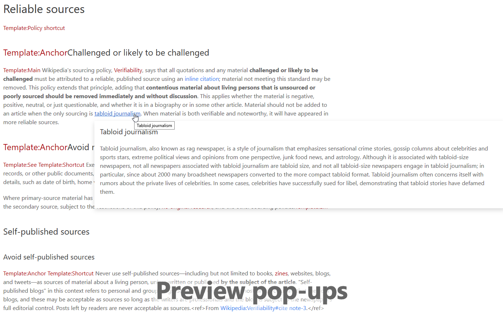
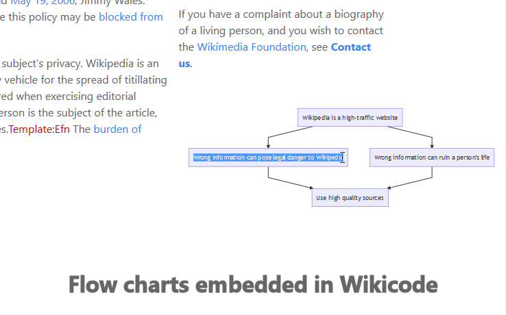
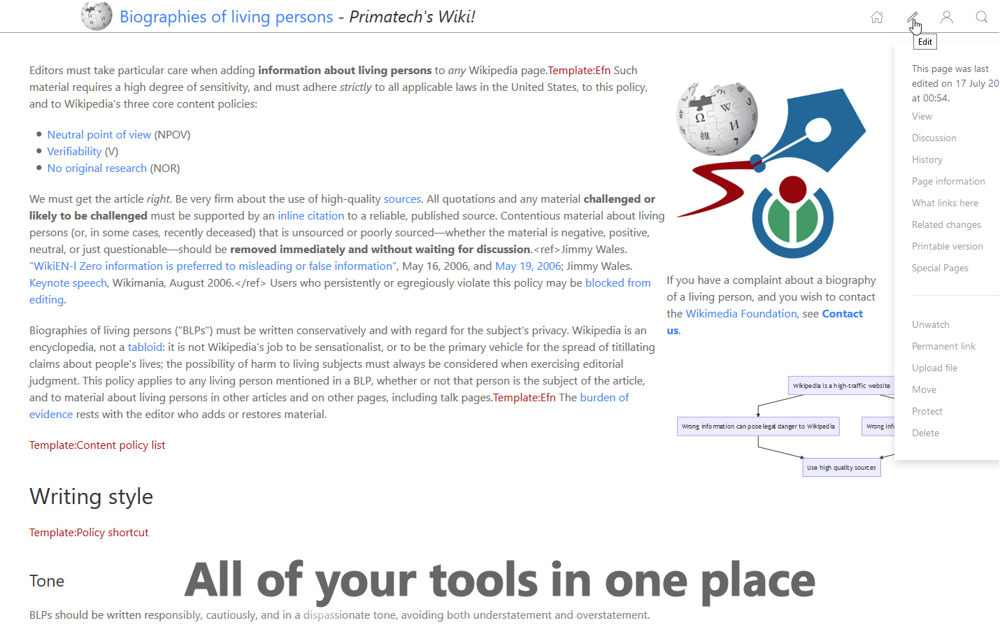
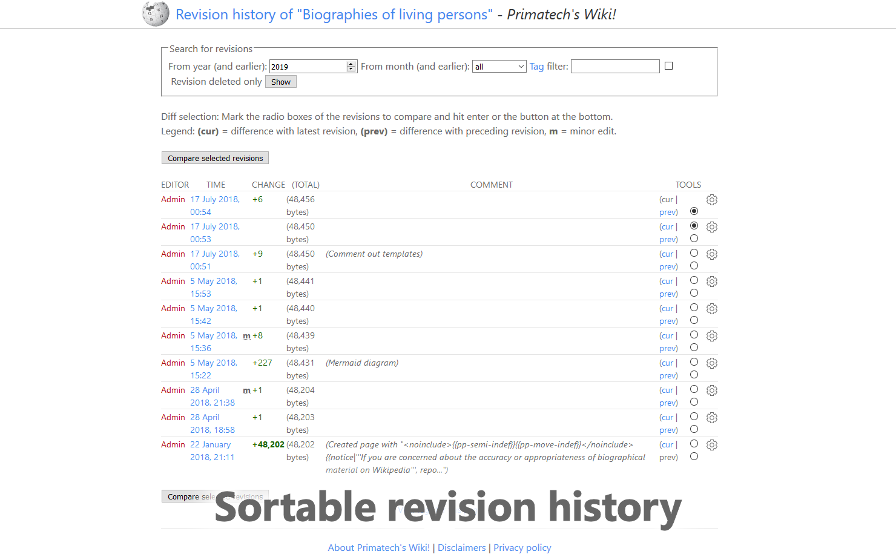

# 2018 MediaWiki skin

_2018_ is a proof of concept [MediaWiki](https://www.mediawiki.org/) skin designed with the following goals:

* Provide a clean, modern and unobtrusive reading environment
* Promote readability through page layout and type
* Enhance the reading experience by providing context and supplementary tools
* Be fully accessible to users with visual or motor impairments
* Render properly on a broad range of user agents

We intend to do that by:

* Using off the shelf technologies and UI components
* Segmenting content into [Schema](https://schema.org/)-friendly, HTML5 semantic elements
* Implementing a [progressively enhancing](https://developer.mozilla.org/en-US/docs/Glossary/Progressive_Enhancement) design with a mix of server-side and client-side logic, with as much of the presentation as possible handled by CSS

## Features







## Installation

### Prerequisites

To deploy this skin either for development or production purposes (_not recommended_) you will need:

1. A running instance of MediaWiki 1.30.0 or higher
2. [npm](https://www.npmjs.com/get-npm)
3. [Composer](https://getcomposer.org/)

### Fetching the skin

From your MediaWiki root, run the following commands:

```
git clone https://gitlab.com/morags/mediawiki-2018-skin.git skins && cd skins/2018
npm install && npm run build
```

### Enabling the skin in MediaWiki

Add the following line to `LocalSettings.php`, which is located in your MediaWiki root:

```php
require_once "$IP/skins/2018/2018.php";
```

You can then enable the skin per user through the MediaWiki GUI (Preferences > Appearance > Skin), or set it as default for all users by adding the following to `LocalSettings.php`:

```php
$wgDefaultSkin = "2018";
```

## Testing

Frontend tests are covered by npm and Grunt:

```
npm test
```

Backend tests are covered by Composer:

```
composer test
```

## License

The skin is released under the MIT license. For more details see the LICENSE file.
